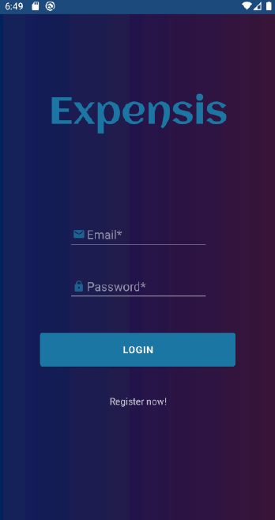
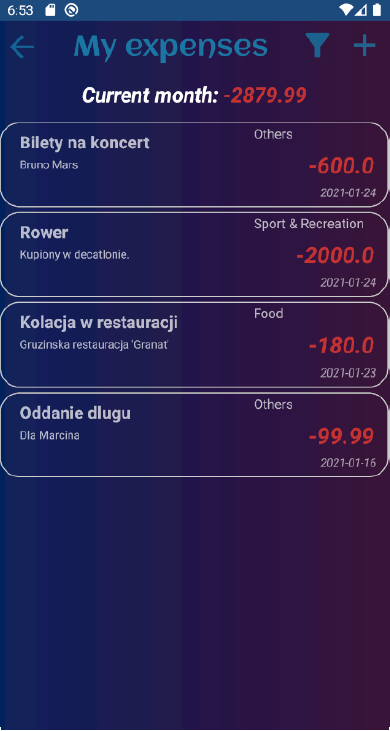
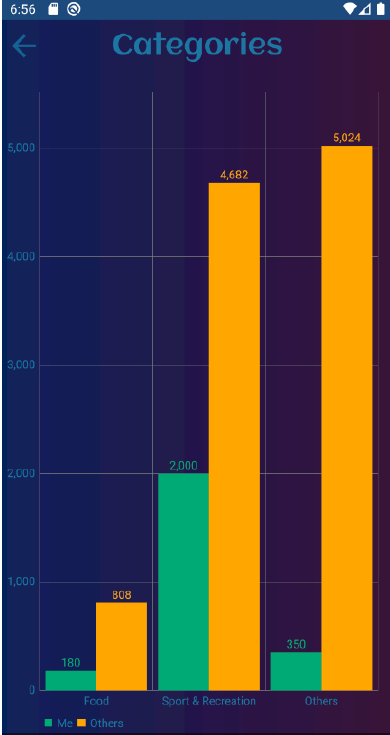

# Expensis Mobile

Expensis is open-source project created to control Your finances.  
This repository mobile client - created using Android studio and Kotlin language.  
Server application and its documentation is available [*here*](https://github.com/AKincel18/Expensis-server).

## Example application pages  
  
  
  
